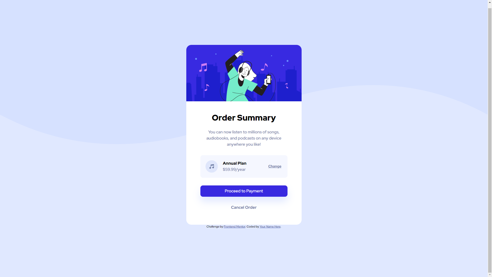

# Frontend Mentor - Order summary card solution
This is a solution to the [Order summary card challenge on Frontend Mentor](https://www.frontendmentor.io/challenges/order-summary-component-QlPmajDUj). Frontend Mentor challenges help you improve your coding skills by building realistic projects. 

## Table of contents
- [Overview](#overview)
  - [The challenge](#the-challenge)
  - [Screenshot](#screenshot)
  - [Links](#links)
- [My process](#my-process)
  - [Built with](#built-with)
  - [What I learned](#what-i-learned)
  - [Continued development](#continued-development)
  - [Useful resources](#useful-resources)
- [Author](#author)

## Overview

### The challenge
Users should be able to:
- See hover states for interactive elements

### Screenshot


### Links
- Solution URL: [Order Summary Card](https://wilsonept.github.io/frontendmentor-order-summary-card/)

## My process

### Built with
- CSS custom properties
- Flexbox
- CSS Grid

### What I learned
I've gotten to know *flex* and *grid* systems and also *svg* format.
- ***Flex system*** was used for display card in center of screen
```html
<body class="flex-container">
```
```css
.flex-container {
    display: flex;
    min-height: 100vh; /* This makes our container fullscreen */
    align-items: center;
}
```
- ***Grid system*** was used for making annual plan box with svg image two text fields and anchor.
```html
<div class="plan-body">
  <svg class="plan-img" xmlns="http://www.w3.org/2000/svg" width="48" height="48"><g fill="none" fill-rule="evenodd"><circle cx="24" cy="24" r="24" fill="#DFE6FB"/><path fill="#717FA6" fill-rule="nonzero" d="M32.574 15.198a.81.81 0 00-.646-.19L20.581 16.63a.81.81 0 00-.696.803V26.934a3.232 3.232 0 00-1.632-.44A3.257 3.257 0 0015 29.747 3.257 3.257 0 0018.253 33a3.257 3.257 0 003.253-3.253v-8.37l9.726-1.39v5.327a3.232 3.232 0 00-1.631-.441 3.257 3.257 0 00-3.254 3.253 3.257 3.257 0 003.254 3.253 3.257 3.257 0 003.253-3.253V15.81a.81.81 0 00-.28-.613z"/></g></svg>
  <h3 class="plan-header">Annual Plan</h3>
  <p class="plan-cost">$59.99/year</p>
  <a class="plan-change" href="_blank">Change</a>
</div>
```
```css
.plan-body {
    display: grid;
}
.plan-img {
    grid-column-start: 1;
    grid-column-end: 2;
    grid-row-start: 1;
    grid-row-end: 3;
}
.plan-header {
    grid-column-start: 1;
    grid-column-end: 2;
    grid-row-start: 1;
    grid-row-end: 2;
}
.plan-cost {
    grid-column-start: 1;
    grid-column-end: 2;
    grid-row-start: 2;
    grid-row-end: 3;
}
.plan-change {
    grid-column-start: 3;
    grid-column-end: 4;
    grid-row-start: 1;
    grid-row-end: 3;
}
```

### Continued development
Technics that I've used needed to improve:
- *margin*
- *padding*
- *flex*
- *grid*

### Useful resources
- [Flex system](https://www.youtube.com/watch?v=_9idibPDs1s&ab_channel=webDev) - This helped me for flex section.
- [Grid system](https://css-tricks.com/snippets/css/complete-guide-grid/) - This helped me for grid section.
- [Button generator](https://css3buttongenerator.com/) - Easy to generate button like you want.

## Author
- Frontend Mentor - [@wilsonept](https://www.frontendmentor.io/profile/wilsonept)
- Twitter - [@wilsonept2](https://www.twitter.com/wilsonept2)